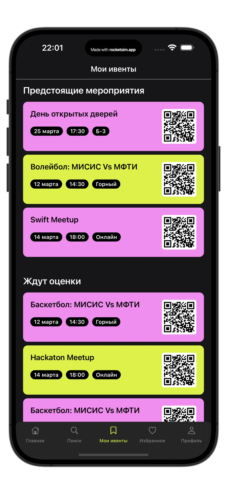

# Eventify - платформа event'ов!

## Технологии

- Язык программирования: Swift
- UI: UIKit
- Автолайаут: SnapKit для упрощения создания констрейнтов
- Статический анализ кода: SwiftLint для обеспечения согласованности кода и следования лучшим практикам
- Пакетный менеджер: SPM (Swift Package Manager)
- Минимальная поддерживаемая версия iOS: iOS 15
- Бэкэнд: Firebase
